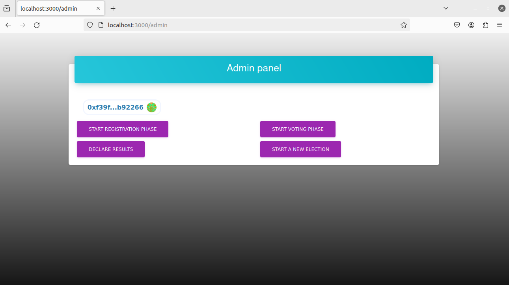
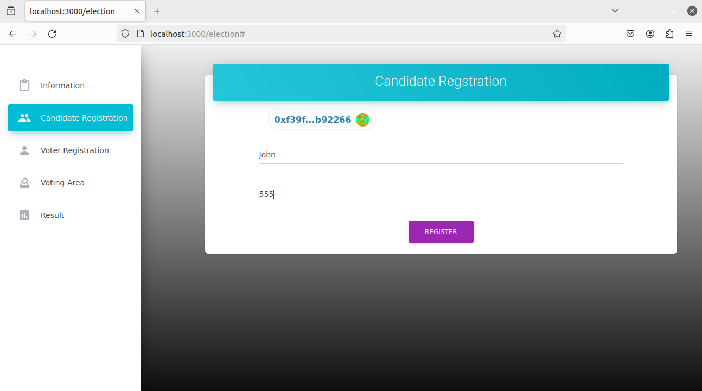
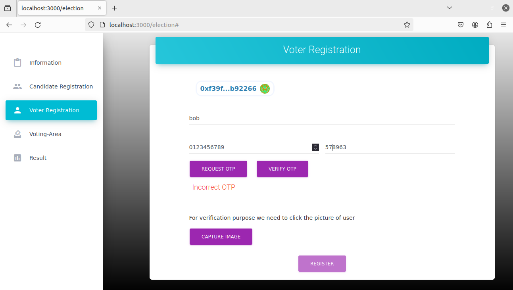
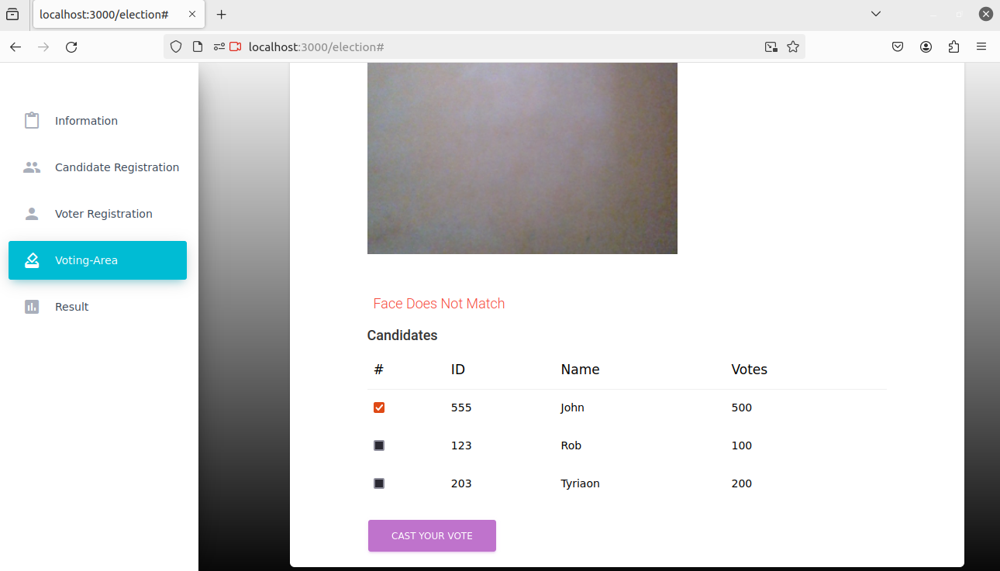
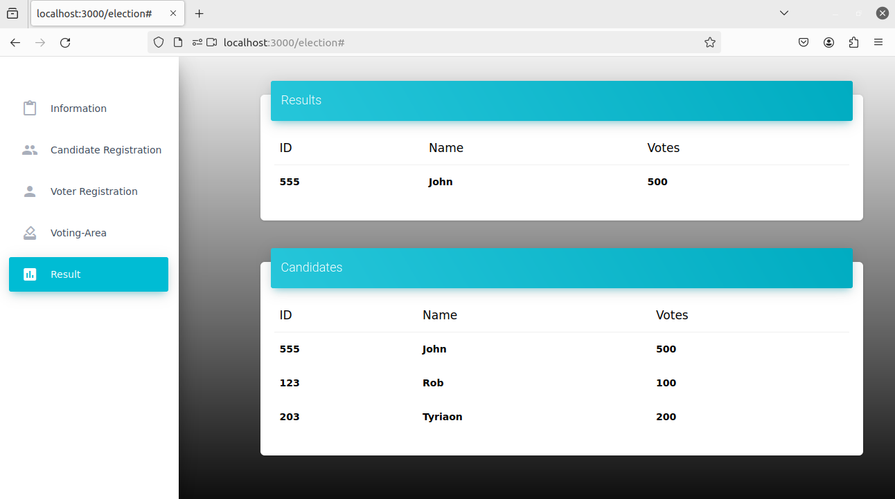

## VoteBlock
A blockchain based voting system.

Project Live at: [VoteBlock](https://vote-block-frontend.vercel.app)

### Installation and Running

For frontend.
```sh
cd frontend
yarn install
yarn start or yarn dev
```

For hardhat.
```sh
cd hardhat
yarn install
yarn hardhat compile
yarn hardhat test
yarn hardhat deploy
yarn hardhat node (optional)
```

### Working

---

<center><b>Admin</b></center>

VoteBlock admin page, where admin can start the Registration phase, Voting phase, Declare result and start a new election.  



---
<center><b>Candidate</b></center>

VoteBlock Candidate page, Candidates can register themselves only when the registration phase has started and by providing their name and a unique ID.




---
<center><b>Voter</b></center>

VoteBlock Voter page, Users can register themselves only when the registration phase has started and by providing name, number, verifying the OTP and picture of themselves.



---
<center><b>Voting</b></center>

VoteBlock Voting page, While voting the voter is in constant facial recognition and if the face doesn't match then voter can not vote.



---
<center><b>Result</b></center>

VoteBlock Result page, Users can view all the candidates and their vote count and the results of the election.



---

